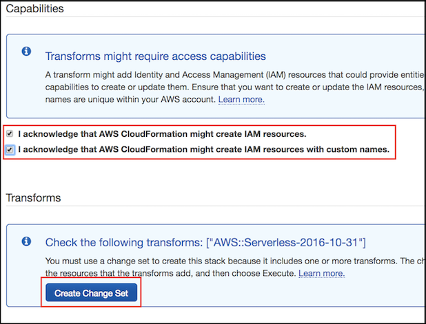

# Module 0: Deploying Amazon Neptune Cluster

In this section, we will create:

- [Amazon Neptune](https://aws.amazon.com/neptune/) Cluster in a private subnet within an Amazon Virtual Private Cloud (VPC)
- AWS Identity and Access Management (IAM) role to load the given dataset from an Amazon S3 bucket into Amazon Neptune cluster. Loading data from an Amazon S3 bucket requires an IAM role that has permissions to  access the S3 bucket. Amazon Neptune assumes this role in order to load the data.
- S3 bucket to copy the given dataset files to.
- An EC2 instance with Gremlin and Sparql clients installed. We will be using Gremlin traversal language to query the graph. 
- A **suggest-food-for-user** lambda function deployed in a VPC which is used to provide food suggestions based on user activities and BMI.

In order to ease the workshop and save time, we have created a CloudFormation template that creates the above resources in your AWS Account. Please note, for this workshop we will be using the **Ireland (eu-west-1)** region.

-----
## Deploy the Cloudformation Stack

Use the following link to create the stack. 

Region| Launch
------|-----
eu-west-1 (Ireland) | [](https://eu-west-1.console.aws.amazon.com/cloudformation/home?region=eu-west-1#/stacks/new?stackName=reinvent-calorietracker-module0&templateURL=https://s3.eu-west-1.amazonaws.com/reinvent-calorie-tracker-workshop/0_NEPTUNE/templates/main.yaml)


 #### Deployment steps:
1. Provide a **Stack Name**
2. Provide following parameter values under **EC2 Configuration** section and leave rest of the parameters with default values.
    - *Key pair name* - Specify an SSH key pair name. If you do not have one, please [create a new KeyPair](https://docs.aws.amazon.com/AWSEC2/latest/UserGuide/ec2-key-pairs.html#having-ec2-create-your-key-pair) from within EC2 console.
    - *S3 bucket name* - This needs to be globally unique.

    

3. Click next. Under **Capabilities**, check both the boxes and click **Create Change Set** under Transform. Then click **Next**.

    

    It will take 15-20 mintues to complete the stack.

4. Once the stack has been successfully deployed, the cloudformation **Output** section will provide the necessary information about the resources being created, as shown below:

    

> Please make a note of the following **Outputs** in a text editor, as we will be using it in the later modules of this workshop.
> - LoaderEndpoint
> - NeptuneLoadFromS3IAMRoleArn
> - S3Bucket

  You could also use the AWS CLI to fetch these details by running:

```bash
$ aws cloudformation describe-stacks --stack-name YOUR-STACK-NAME-HERE --query 'Stacks[0].Outputs'
``` 

---
**Congratulations!** You have successfully setup an Amazon Neptune cluster.

Next, we will be setting up the [AWS Cloud9 environment Development Environment](../1_AWS_Cloud9/README.md)

[Go back to the home page](../README.md)