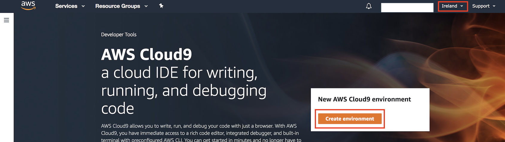
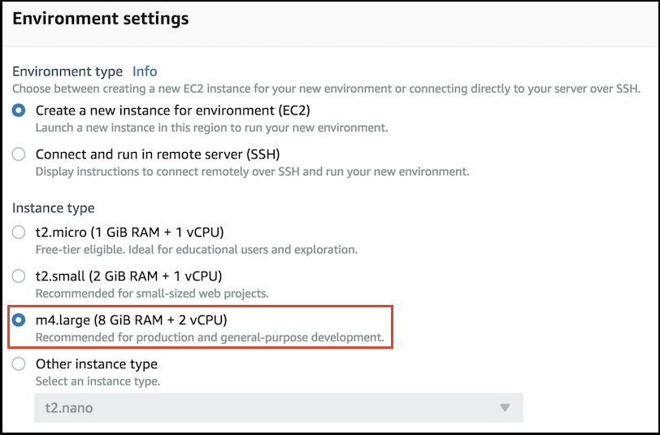
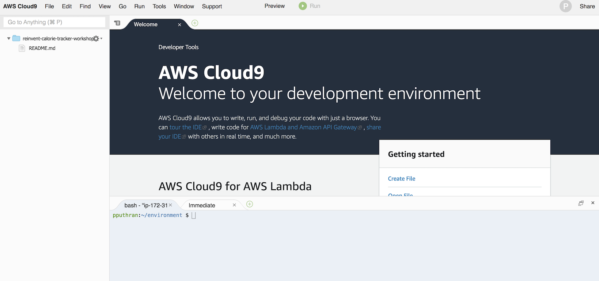
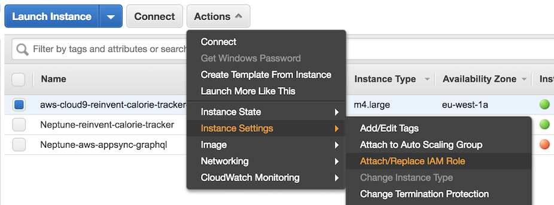
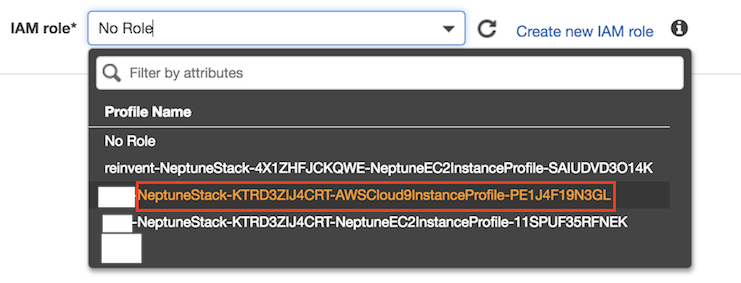
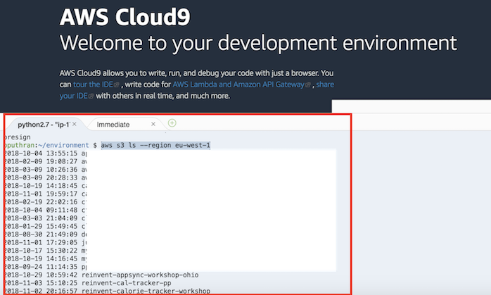

# Module 1: Preparing your AWS Cloud 9 Development Environment

AWS Cloud9 is a cloud-based integrated development environment (IDE) that lets you write, run, and debug your code with just a browser. 

In this section, we will create a AWS Cloud9 (C9) environment and configure it to access AWS resources.

1. Open the [AWS Cloud9 console](https://console.aws.amazon.com/cloud9/)

2. Choose **Ireland** region. Please ensure you are in the correct AWS region.

  	

3. Click `Create Environment`

4. Name - `reinvent-calorie-tracker-workshop` and Click Next Step

5. Under `Environmnent Settings`, choose **Create a new instance for environment (EC2)** and instance type as **m4.large**.

  	

6. Clic `Next Step` and click `Create Environment`. This will take 3-5 minutes to create the environment.

7. Once your environment is ready, you will see the following screen. The bottom half of your window, you can see the Cloud9 terminal.

  	


8. Attach an IAM role to your Cloud9 EC2 instance.
	> IAM roles for EC2 make it easier for your applications to make API requests securely from an instance because they do not require you to manage AWS security credentials that the applications use.
	
    1. Go to EC2 console. Make sure you are in **Ireland** region. Search for the keyword `aws-cloud9-reinvent-calorie-tracker-workshop-` and select the instance. Under `Actions` | `Instance Settings` | Select `Attach or Replace IAM Role`

		

    2. Search for the IAM Role with keyword `AWSCloud9InstanceProfile` and select the role that appears in the search result. Click `Apply`.

    	

9. Go to the Cloud9 console and within the terminal windows type the following S3 list command to view the S3 buckets in your region. If you are able to see the list of S3 buckets, it means your Cloud9 envrionment has been successfully setup with right permission required for this workshop.
	```
	aws s3 ls --region eu-west-1
	```

    

10. Verify the NodeJS version via the Cloud9 terminal.

	```
	$ node -v
	v6.14.4
	```

	Update the node.js version, if you are running < 8
	
	```
	$ nvm install 8
	Now using node v8.12.0 (npm v6.4.1)
	```

	After the upgrade, verify the NodeJS version.
	
	```
	$ node -v
	v8.13.0
	```

## Cloning the project

Within your `AWS Cloud9 environment`, clone the workshop GitHub repo.

```
Admin:~/environment $ git clone https://github.com/aws-samples/aws-appsync-calorie-tracker-workshop.git
Admin:~/environment $ cd aws-appsync-calorie-tracker-workshop
```

  

---

Congratulations!!! You have completed setting up your AWS Cloud9 environment and have cloned the project. In the next section, you will [load the given dataset into Amazon Neptune Cluster](../2_LOAD_DATA/README.md)

[Go back to the home page](../README.md)
