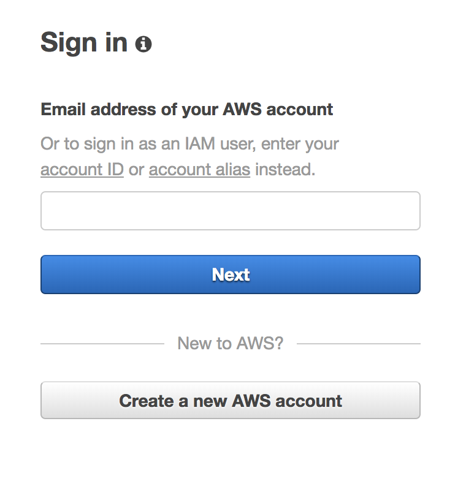
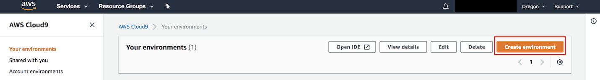

# AWS Cloud 9 

AWS Cloud9 is a cloud-based integrated development environment (IDE) that lets you write, run, and debug your code with just a browser.

In this section, we will create a AWS Cloud9 environment and configure it to access AWS resources.

1. Open the [AWS Cloud9 console](https://console.aws.amazon.com/cloud9/)

>  If you are prompted with the below screen, type the email address for the AWS account root user, choose Next, type the password for the AWS account root user and then choose Sign In. 
> 

> Follow the steps described [here](https://docs.aws.amazon.com/IAM/latest/UserGuide/getting-started_create-admin-group.html) to create a new IAM user with administrative privileges. 

> For the purpose of this workshop, its ok to use the user with adminstrative privileges. Please consider restrictive access/least privilege approach when running in production.

2. Please choose either `us-east-2 / US East (Ohio) Region`
   or `us-west-2 / US West (Oregon) Region`

3. Click `Create Environment`

> 

4. Name - `reinvent_appsync_workshop` and Click Next Step

5. Under `Environmnent Settings`, choose **Create a new instance for environment (EC2)** and instance type as **t2.micro**. Keep the rest of the settings default, `Next Step` and click `create environment`.

6. Verify the NodeJS version via the Cloud9 terminal.
``` 
node -v 
````
Update the node.js version, if you are running < 8
```
nvm install 8
```

7. Set the AWS Credentials. 

```
$ aws configure
AWS Access Key ID [None]: `Enter the AWS Access Key Id`
AWS Secret Access Key [None]: `Enter the AWS Secret Key`
Default region name [None]: `Enter the region that you are using`
Default output format [None]:
```
[Next section - Setting up Amazon Netptune Cluster](../2_neptune_stack/README.md)

[Back to home page](../README.md)


