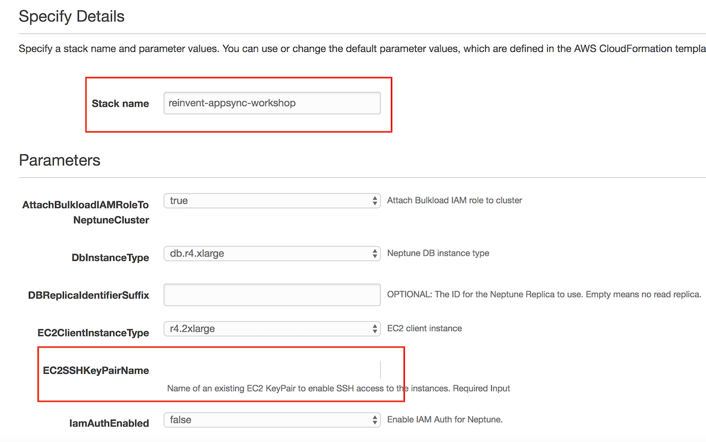
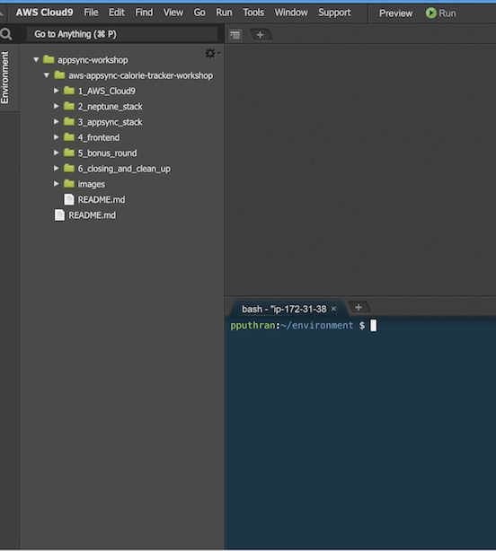
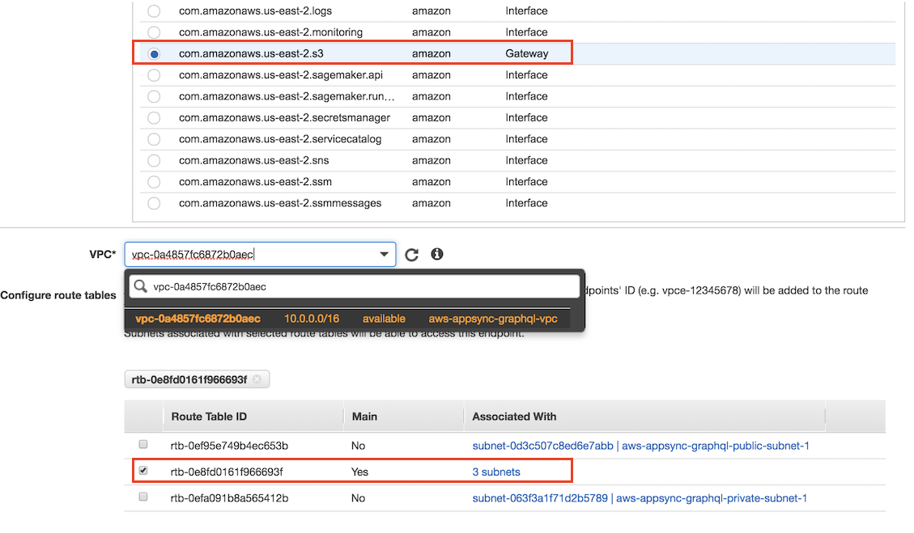

# Deploying Amazon Neptune Cluster


In order to ease the workshop we have created a CloudFormation Stack that deploys the following assets:

- Amazon Neptune Cluster within a VPC in a private subnet.
- IAM Role with policy given dataset from S3 into Amazon Neptune.
- An EC2 instances with Gremlin and Sparql clients installed. We will be using this EC2 instance and use the Gremlin traversal language to query the graph.
- A **suggestFood** lambda function deployed in a VPC that provides food suggestions based on user activities and personal information such as BMI.

Steps:
- [1.1. Deploy the Cloudformation Stack](#11-Deploy-CloudFormation-Stack)
- [1.2. Git Clone the project](#12-Git-Clone)
- [1.3. Creating S3 bucket](#13-Creating-S3-bucket)
- [1.4. Creating S3 VPC Endpoint](#14-Creating-Amazon-S3-VPC-Endpoint)
- [1.5. Loading the dataset into Neptune](#15-Loading-the-given-food-dataset-into-Amazon-Neptune)
- [1.6. FoodSuggestor Lambda function](#16-FoodSuggestor-lambda-function)

-----
## 1.1. Deploy the Cloudformation Stack

Use the following link to deploy the stack. 

Region| Launch
------|-----
us-east-2 | [](https://us-east-2.console.aws.amazon.com/cloudformation/home?region=us-east-2#/stacks/new?stackName=[reinvent-appsync-workshop]&templateURL=https://s3.us-east-2.amazonaws.com/reinvent-appsync-workshop-ohio/2_neptune_stack/templates/main.yaml)



- Provide the stack name
- Specify the SSH keyPair name. If you do not have one, please [create a KeyPair](https://docs.aws.amazon.com/AWSEC2/latest/UserGuide/ec2-key-pairs.html#having-ec2-create-your-key-pair) from within EC2 console.

Verify if the Cloudformation stack has been successfully deployed.

## 1.2. Git Clone the project

In Cloud9 terminal, please clone the github repo:

``` 
git clone ssh://git.amazon.com/pkg/Jupitera-calorie-tracker -b draft
```

> Internal Note: the above github link will be replaced with public github repo



-----

## 1.3. Creating S3 bucket

- Run the following command in the Cloud9 terminal. Please make sure you provide `a bucket name` and `region`.

Please create the bucket in `us-east-2 / US East (Ohio)` Region

```
aws s3api create-bucket --bucket <provide-an-unique-bucket-name> --region us-east-2
```

- Copy the `datasets` folder under `2_neptune_stack` into your newly created S3 bucket.


```
aws s3 cp 2_neptune_stack/datasets/ s3://<your-bucket-name>/ --recursive
```
------

## 1.4. Creating Amazon S3 VPC Endpoint

Before loading the above datasets from S3, we need to create a Amazon S3 VPC Endpoints 

1. Sign in to the AWS Management Console and open the Amazon VPC console at https://console.aws.amazon.com/vpc/.

2. In the left navigation pane, choose Endpoints.

3. Choose Create Endpoint.

4. Choose the Service Name `com.amazonaws.region.s3`.

> Note:
>   Please make sure you choose the correct AWS region is correct.

5. Choose the VPC that contains your Neptune DB instance.

6. Select the check box next to the route tables that are associated with the subnets related to your cluster. If you only have one route table, you must select that box.



7. Under `Policy`, copy the following

```json
{
    "Version": "2012-10-17",
    "Statement": [
        {
            "Effect": "Allow",
            "Principal": "*",
            "Action": "s3:*",
            "Resource": "*"
        }
    ]
}

```

8. Choose Create Endpoint.

----------

## 1.5. Loading the given food dataset into Amazon Neptune

In this workshop, we are using the Health and Nutrition Dataset provided by the [Center for Disease Control and Preventation](https://wwwn.cdc.gov/nchs/nhanes/search/datapage.aspx?Component=Dietary&CycleBeginYear=2015). NHANES conducts studies designed to assess the health and nutritional status of adults and children in the United States. The survey is unique in that it combines interviews and physical examinations.

The datasets that needs to be loaded into Amazon Neptune are available under the `datasets` folder. 

`Vertex.csv` contains userId, demographics information about the user such as weight (kg), height (cm) and their BMI. 

`food_edges.txt` contains the gremlin queries that creates the edges/relationships between the vertices.

Step 1: SSH into the EC2 instance and type the following:

```
curl -X POST \
    -H 'Content-Type: application/json' \
    <http://your-neptune-endpoint:8182/loader> -d '
    { 
      "source" : "s3://<your-bucket-name>/vertex.csv, 
      "iamRoleArn" : "arn:aws:iam::account-id:role/role-name",
      "format" : "csv", 
      "region" : "<region>", 
      "failOnError" : "FALSE"
    }'
```

> Replace the `neptune loader endpoint`, `source S3` and `IAM Role ARN`. You can find these from CFN outputs.


---
You can check the status of your load with the following command:

```
curl http://your-neptune-endpoint:8182/loader?loadId=[loadId value]
```

Step 2: Next, copy and paste the following

```
cd apache-tinkerpop-gremlin-console-3.3.2
bin/gremlin.sh
:remote connect tinkerpop.server conf/neptune-remote.yaml
:remote console
```

Step 3: Copy and paste all the queries from `food_edges.txt` into the gremlin console

Test the following queries:

Prints all the Vertices
```
g.V().count()
```

Returns the list of users whose BMI < 24

```
g.V().has('bmi',lte(24)) 
```

----

## 1.6. FoodSuggestor lambda function.

Under AWS lambda, you will find a Lambda function named `FoodSuggestorFunction`. This is essentially running the following gremlin query where:

- gremlin is traversing the vertex with label `person` and has a property `bmi` less than or equal to 24.
- Get the outgoing traversal with edges as `has` and label it as `food`.
- In the same way, get the outgoing traversal with edges as `eats`.
- Then we filter the results where calories is less than 400, sugar is less than 2 gm, return the `name` of food types that match this criteria and label the output as `type`.
- Select the objects labels `food` and `type` from the path and remove (`dedup`) any repeated items.

```

g.V().has('person','bmi',lte(24)).out('has').id().as('food').out('eats').filter(values('calorie').is(lt(400))).filter(values('sugar').is(lt(2))).values('name').as('type').select('food','type').dedup()

```


- In order to test this Lambda function, copy the following as test input

```
{
  "bmi": 24,
  "calorie": 400,
  "sugar": 2,
  "userid": "239213-321421"
}
```
- Enter a new event name and click `create`.
- Test the lambda function which should return a list of suggested food based on the given BMI

Congratulations. You have successfully created an Amazon Neptune Cluster, loaded the given dataset from S3 using Amazon S3 VPC endpoint, run Gremlin queries and have tested the foodSuggestor lambda function.

[Proceed to next section - Amazon AppSync](../3_appsync_stack/README.md)

[Back to home page](../README.md)
