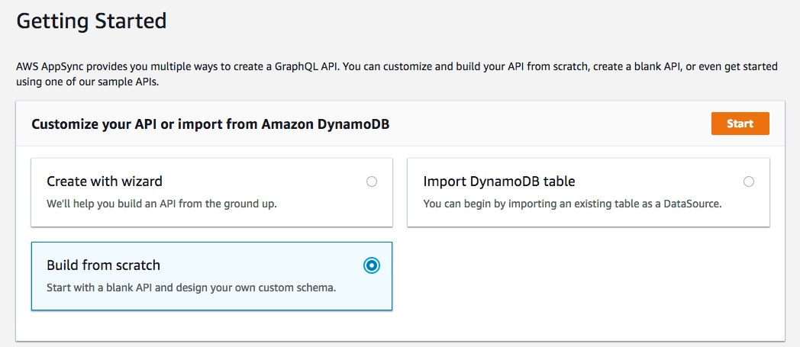
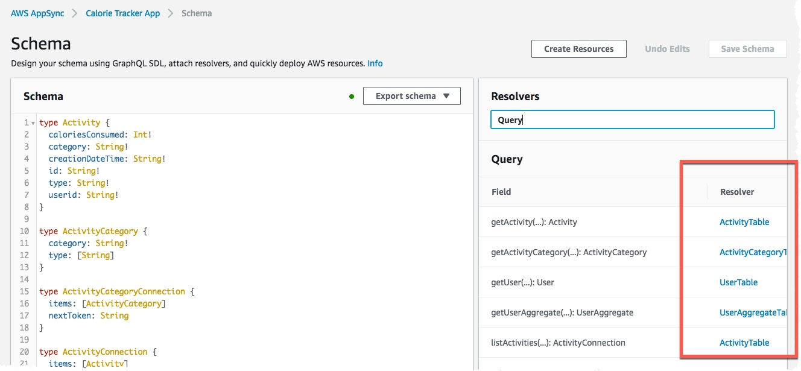

# Create DynamoDB tables and AppSync backend

In this section, we will create the backend for our application. We will use AWS DynamoDB to store user information and AWS AppSync to create GraphQL based backend.

To simplify the process, we will use AWS CloudFormation templates to create resources for our application backend.

### Step 1: Create DynamoDB Tables and Lambda function

In this step, we will create 4 dyanmoDB tables and a Lambda function using CloudFormation template. DynamoDB tables are used to store user information and Lambda function is used to aggregate the user calories based on the user activities and update it in User Aggregate table. If the activity category is either Food or Drink, it will add the calories to the 'caloriesConsumed' field for the user. If the activity category is Exercise, it will add the calories to the 'caloriesBurned' field for the user.

The Lambda function will be executed every time user logs an activity in the app, using User activity DynamoDB stream.

Execute following CLI command to create the CloudFormation stack.
```
aws cloudformation create-stack --stack-name dynamoDBLambdaStack --template-body file://templates/dynamodb-lambda.yaml --parameters ParameterKey=APIName,ParameterValue=caltrack ParameterKey=S3BucketName,ParameterValue=reinvent-2018
```
When the stack creation is completed successfully, you will have following 4 tables and a Lambda function created. You can check the status of your stack from the CloudFormation console.
- caltrack_user_table
- caltrack_activity_table
- caltrack_activity_category_table
- caltrack_user_aggregate_table

Execute following CLI command to load the sample activity categories to be used by the app.
```
aws dynamodb batch-write-item --request-items file://assets/activity-categories.json
```

### Step 2: Create AppSync API backend
Now, we will use the DynamoDB tables created in Step 1 to create GraphQL backend. Open the AWS AppSync Console and click **Create API**.


Choose **Build from Scratch** and click **Start**.



Enter a name for your API (e.g. '*Calorie Tracker App*') and click **Create**.

#### 2.1 Setup data sources
We will be using DynamoDB as our data sources. We will create 4 data sources, one for each DynamoDB table.

**UserTable data source**

On the left pane, select **Data Sources**. Click **New**. Fill the details as provided below and click **Create**.
- Data source name: *UserTable*
- Data source type: *Amazon DynamoDB table*
- Region: *{Region in which you are in}*
- Table name: *caltrack_user_table*


**ActivityTable data source**

Click **New**. Fill the details as provided below and click **Create**.
- Data source name: *ActivityTable*
- Data source type: *Amazon DynamoDB table*
- Region: *{Region in which you are in}*
- Table name: *caltrack_activity_table*

**UserAggregateTable data source**

Click **New**. Fill the details as provided below and click **Create**.
- Data source name: *UserAggregateTable*
- Data source type: *Amazon DynamoDB table*
- Region: *{Region in which you are in}*
- Table name: *caltrack_user_aggregate_table*

**ActivityCategoryTable data source**

Click **New**. Fill the details as provided below and click **Create**.
- Data source name: *ActivityCategoryTable*
- Data source type: *Amazon DynamoDB table*
- Region: *{Region in which you are in}*
- Table name: *caltrack_activity_category_table*

#### 2.2 Setup AppSync Schema
In this section we will create a GraphQL Schema. In the following first few steps, we will show you how to create type, query and mutations from scratch. But, in the interest of time, we have the GrapphQL schema pre-created for you, which you can directly copy and paste in your schema editor.
- On the left pane, select **Schema**.
  ##### Create Type - User
  - First, we will create a **User** type which will contain the attributes we want to store in DynamoDB table for each user. It will look something like below. Copy the type from below and paste it in your AppSync Schema.
  ```
  type User {
  	caloriesConsumed: Int
  	caloriesTargetPerDay: Int!
  	height: Float!
  	id: String!
  	username: String!
  	weight: Float!
  	bmi: Float
  }
  ```

  ##### Create Query - getUser
  - Now we will create a Query type **getUser** to fetch user details based on the User Id.
  - To create **getUser** query type, copy the text from below and paste it in your AppSync Schema.
  ```
  type Query {
	   getUser(id: ID!): User
  }
  ```
  - The query **getUser** take **ID** as input argument and returns **User** type.

  ##### Create Mutation - createUser
    - Now let's create a Mutation type **createUser**. This mutation will be used by our app to store user information.
    - To create **createUser** mutation type, copy the text from below and paste it in your AppSync Schema.
    ```
    type Mutation {
    	createUser(input: CreateUserInput!): User
    }

    input CreateUserInput {
    	id: String
    	caloriesConsumed: Int
    	caloriesTargetPerDay: Int!
    	height: Float!
    	username: String!
    	weight: Float!
    }
    ```
    - The mutation **createUser** takes **CreateUserInput** as input argument and return **User** type. **CreateUserInput** is an Input type which contains the attributes we want to store for each user.


- To save time, we have pre-created the schema. Copy the contents of the **assets/schema.graphql** file, select all in your Schema editor and paste the schema, then lick **Save**.

  

- At this point, you have your GraphQL schema ready for your app, but we do not have the resolvers configured. In next section, we will configure resolvers for our types.

#### 2.3 Configure resolvers
We will configure query, mutation and subscription resolvers in this step. Before configuring your resolvers, get your AppSync API Id.
- On the left page, select **Settings**.
- Click **Copy** button next to the API ID field.
- Replace **API_ID** with your API ID, in the command below.
- Execute the CLI command below. It will launch a CloudFormation stack to configure resolvers.
  ```
  aws cloudformation create-stack --stack-name resolver-stack --template-body file://templates/appsync-resolvers.yaml --parameters ParameterKey=AppSyncApiId,ParameterValue=3xrxari5hzamrb4vhq4ryms7iu ParameterKey=AppSyncUserTableDataSourceName,ParameterValue=UserTable ParameterKey=AppSyncActivityTableDataSourceName,ParameterValue=ActivityTable ParameterKey=AppSyncActivityCategoryTableDataSourceName,ParameterValue=ActivityCategoryTable ParameterKey=AppSyncUserAggTableDataSourceName,ParameterValue=UserAggregateTable
  ```
- When the CloudFormation stack is completed successfully, you will have your resolvers configured.

  

## Summary
You have successfully created DynamoDB tables, Lambda function and AWS AppSync GraphQL backend.

AppSync is setup to use DynamoDB tables as data sources to persist user information.

Lambda function is subscribed to DynamoDB streams and is setup to be triggered every time user add or delete an activity.

## License Summary
This sample code is made available under a modified MIT license. See the LICENSE file.

[Proceed to next section - Setting up the frontend application](../4_frontend/README.md)

[Back to home page](../README.md)
