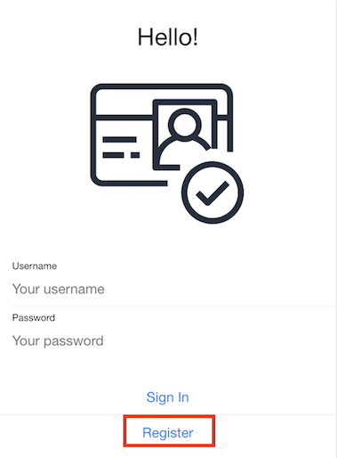
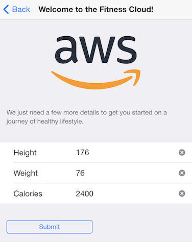
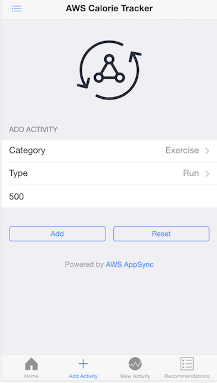
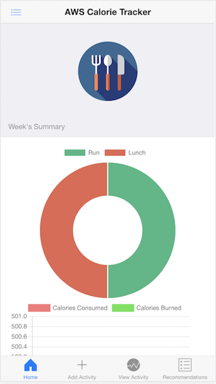

# Testing the Calorie Tracker application end to end

### Signup new user



### Register


### Setup your height, weight and daily calorie goal



### Add activities for each of the categories



### View the dashboard in the home page



### Next, lets check the suggested food

Oops!!!. if you find the page spinning and dont get any suggestions, lets configure it and get it working

#### Step 1: Setup a new Appsync Data source:

1. Go to AWS Appsync console, `data source`.


2. Click `New`, Data Source Name: `suggestedFood`
3. Data Source type as `AWS Lambda function`
4. Region: `EU-WEST-1` and function ARN as `suggested-food-for-user`
5. Create a new role and click `Create`

#### Step 2: Adding suggestedFood query to Appsync schema:
1. Under your Appsync schema, locate `type Query`, ensure you have `suggestedFood` query. If not, please add the following after `listUsers` and `Save Schema`.

```
	suggestedFood(
		bmi: Float,
		calorie: Float,
		sugar: Float,
		userid: String!
	): [Activity]

```
2. Under `Resolvers` in the right pane, locate suggestedFood


3. Click Attach
4. `Create a New Resolver`
5. Select `suggesteFood` data source that was created in Step 1


6. Save Resolver.

#### Step 3: Updating the graphql schema in your code:

Within `4_FRONTEND_APP/src/graphql/queries.js`, updated the `suggestedFood` schema to return only category and type. Save the code change.

```Javascript
export const suggestedFood = `query SuggestedFood(
  $userid: String!
  $bmi: Float
  $calorie: Float
  $sugar: Float
) {
  suggestedFood(userid: $userid, bmi: $bmi, calorie: $calorie, sugar: $sugar) {
    category
    type
  }
}
`;
```

Recomplie the app and you should see the suggestions being returned


### Other Ideas (TODO):
- Login to app using Cognito's Federated Auth - Facebook
- Fine the gremlin query to provide personalized suggestions

[Proceed to next section - Closing and Cleanup](../6_CLEANUP/README.md)

[Back to home page](../README.md)