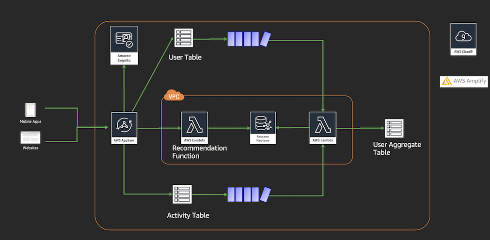

# Building Serverless Calorie tracker application with AWS AppSync and Amazon Neptune

## Overview 

In this workshop, you will build a serverless Calorie tracker application that will allow users to setup a calorie target goal, allows you to add,update and track the calories consumed or burned on a daily basis as well  receive food suggestions based on their food habits.

Some of the features that you would be building today are:
- User sign-up, login and logout.
- Set personal information like calorie target per day, height, weight etc.
- Track activities through out the day like add calories (breakfast, lunch, dinner, snacks) and burn calories (workout, walk, run)
- View suggested food based on the activities and personal information such as BMI.

## Architecture diagram:

## Services used:
- AWS AppSync
- AWS Lambda
- Amazon DynamoDB
- Amazon Cognito
- Amazon Neptune

## Requirements

This workshop requires:

- An active AWS Account with administrative permissions.
- If you are using your own laptop, you should have [npm](https://docs.npmjs.com/getting-started/installing-node) and [git](https://git-scm.com/book/en/v2/Getting-Started-Installing-Git) installed.
- Knowledge of Javascript/ NodeJS will be an added advantage.
- Knowledge of Amazon DynamoDB, AWS Lambda and Amazon Cognito will be an added advantage.

## Steps:
0. [Deploying Amazon Neptune Cluster](./0_NEPTUNE/README.md)
1. [Setting up AWS Cloud 9](./1_AWS_Cloud9/README.md)
2. [Loading dataset into Neptune Cluster](./2_LOAD_DATA/README.md)
3. [AWS AppSync - GraphQL](./3_APPSYNC/README.md)
4. [Setting up frontend - Vuejs application](./4_FRONTEND_APP/README.md)
5. [Bonus Round - Optional](./5_BONUS_OPTIONAL/README.md)
6. [Closing and Clean up](./6_CLEANUP/README.md)
